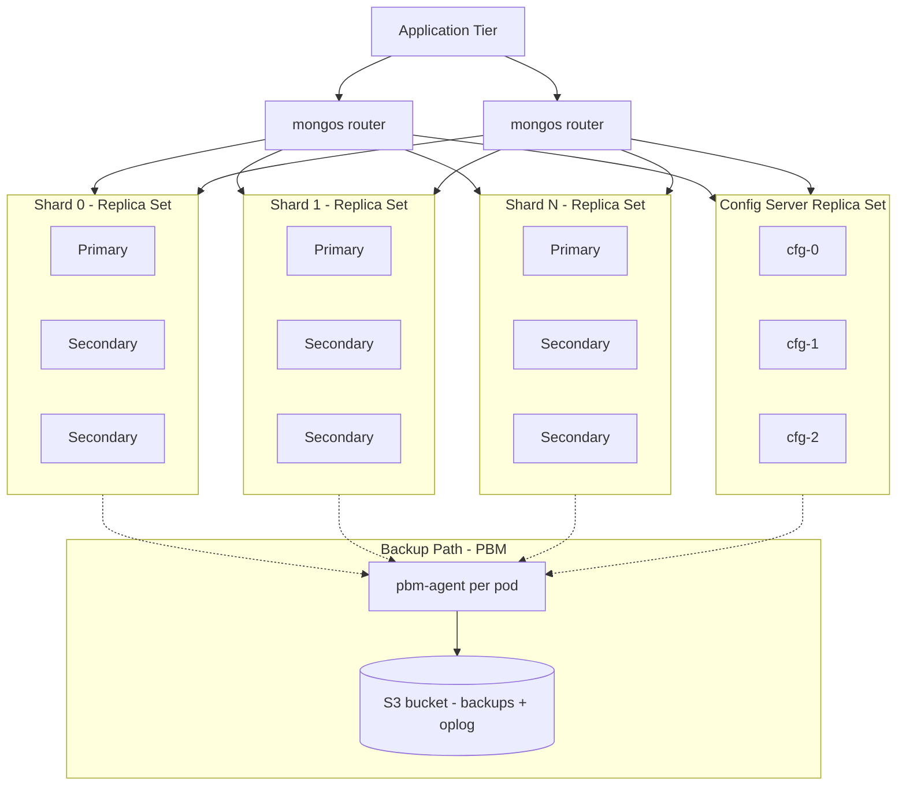

# Architecture: MongoDB on Kubernetes (Percona Operator)

This is the technical design for running a sharded, self-hosted MongoDB cluster on AWS EKS, sized for 2-5 TB of data, with backup and point-in-time recovery (PITR) built in from day one.

## 1. Why the Percona Operator

We evaluated four ways to run MongoDB on Kubernetes:

| Option | Sharding | Backup + PITR | Cost | Verdict |
|---|---|---|---|---|
| **Percona Operator for MongoDB** | Yes, native | Yes, native (logical, physical, incremental, PITR) | Free, Apache-2.0 | **Recommended** |
| MongoDB Community Operator / MCK (community path) | No | No | Free | Too limited for our scale/HA needs |
| MongoDB Enterprise Operator / MCK (enterprise path) | Yes | Yes, but only via Ops Manager or Cloud Manager | Requires a paid Enterprise Advanced license | Defeats the cost-saving goal |
| KubeDB | Yes (Enterprise tier only) | Yes (Enterprise tier only) | Paid license for the features we need | Same problem as above |
| Bitnami Helm chart | Manual | Manual | Free | Not an operator — no automated failover/backup orchestration |

Percona is the only option that gives us production-grade sharding, backup, and PITR without a commercial license sitting underneath it. It wraps Percona Server for MongoDB, which is a drop-in, wire-compatible build of MongoDB Community Edition with extra enterprise features (LDAP/Kerberos, audit logging, encryption) added in.

## 2. Cluster topology

A sharded MongoDB deployment has three moving parts, and the Operator manages all of them as Kubernetes StatefulSets:

- **Shards** — each shard is its own 3-node replica set holding a slice of the data
- **Config Server Replica Set (CSRS)** — a 3-node replica set that stores cluster metadata (which chunk of data lives on which shard)
- **mongos routers** — stateless query routers; the application talks to these, never to a shard directly



Safe-minimum defaults (matches what the Operator enforces out of the box): 3 members per shard, 3 config servers, at least 2 mongos routers.

## 3. Sizing for 2-5 TB

Storage math has to account for the 3x replication factor plus WiredTiger overhead and headroom for growth — raw disk needed is roughly **user data x 3 (replicas) x ~1.3 (overhead/headroom)**.

| Scenario | User data | Shards | Raw storage needed (approx.) | Per-shard node | Config server node | mongos |
|---|---|---|---|---|---|---|
| Starting point | 2 TB | 2 | ~7.8 TB | r6i.2xlarge (8 vCPU / 64 GB), 1.3 TB gp3 EBS per node | r6i.xlarge (4 vCPU / 32 GB), 100 GB gp3 | r6i.large x 2 |
| Growth target | 5 TB | 4 | ~19.5 TB | r6i.2xlarge (8 vCPU / 64 GB), 1.6 TB gp3 EBS per node | r6i.xlarge (4 vCPU / 32 GB), 100 GB gp3 | r6i.large x 2-3 |

Notes:
- These are starting points for the proposal, not final sizing — actual CPU/RAM should be confirmed against real working-set size, peak IOPS, and connection counts once we have access to current Atlas metrics.
- Shard count is chosen to keep each shard's data comfortably below ~2.5-3 TB per node, leaving room to add shards later without re-sharding pain (adding a shard is a config change; re-sharding existing collections onto a new shard key is not).
- gp3 EBS gives 3,000 IOPS / 125 MB/s baseline for free; we can provision more if the workload needs it, which is usually cheaper than jumping to io2.

## 4. High availability

- **Multi-AZ, single region** (per current scope — no multi-region DR yet). Every replica set (shards + config servers) spreads its 3 members across 3 Availability Zones using pod anti-affinity rules, so a single AZ outage never takes down a majority of any replica set.
- Node groups span the same 3 AZs so the Kubernetes scheduler always has a healthy AZ to reschedule onto.
- If a primary fails, MongoDB's own replica set election promotes a secondary automatically — no manual intervention, no application changes (drivers reconnect via the replica set URI).
- If the Operator's pod is rescheduled, it doesn't affect the running database — the Operator only reconciles state, it isn't in the data path.
- **Future-proofing**: the Percona Operator natively supports multi-cluster/multi-region replication (a "Main site" + one or more "Replica sites"). We're not building this now, but the architecture doesn't preclude adding it later if the customer wants cross-region DR.

## 5. Backup and point-in-time recovery

This is the feature that was explicitly called out as a requirement, so it gets its own section.

Percona Backup for MongoDB (PBM), which ships with the Operator, supports three backup types:

| Backup type | Speed | Best for | Supports PITR? |
|---|---|---|---|
| Logical | Slower, smallest storage footprint | Small collections, selective restore | Yes |
| Physical / incremental | Fast, scales well to multi-TB | Full-cluster restores at our data size | Yes |
| PVC snapshot (CSI) | Fastest, no data leaves the cluster to object storage | Quick full-cluster restore / DR drills | **No** |

**Our recommended approach**: run physical/incremental backups on a schedule (e.g. nightly full + hourly incremental) with PITR enabled, and layer in periodic PVC snapshots for the fastest possible full-cluster recovery drills. This gives us both fine-grained recovery (restore to any second) and fast, cheap full restores.

How PITR actually works: once `backup.pitr.enabled: true` is set and a full backup exists, PBM continuously ships oplog chunks (every 10 minutes by default, tunable) to the backup storage (S3). To recover, you restore the nearest full backup and PBM replays the oplog on top of it up to the exact second you ask for:

```yaml
apiVersion: psmdb.percona.com/v1
kind: PerconaServerMongoDBRestore
metadata:
  name: restore-to-a-point-in-time
spec:
  clusterName: prod-cluster
  backupName: nightly-backup-2026-09-14
  pitr:
    type: date
    date: "2026-09-14 09:15:00"
```

Backup storage: an S3 bucket with a lifecycle policy — recent backups in S3 Standard, older ones (30+ days) moved to Glacier for cheap long-term retention. Retention windows (e.g. 7 daily / 4 weekly / 12 monthly) are a policy decision we should confirm with the customer, not a technical constraint.

Restore caveat worth flagging to the customer: restoring a sharded cluster causes brief downtime (mongos routers are recreated so clients don't see stale routing), so restore drills should be planned, not assumed to be zero-impact.

## 6. Security and networking (brief)

- TLS everywhere: client-to-mongos, mongos-to-shard, and intra-replica-set traffic, using certificates the Operator manages automatically.
- Encryption at rest via EBS volume encryption (AWS-managed or customer-managed KMS key) plus MongoDB's own encrypted storage engine option.
- Network policies restrict pod-to-pod traffic to only what's needed (app -> mongos, mongos -> shards/config servers, pbm-agent -> S3 via IRSA).
- S3 access for backups uses IAM Roles for Service Accounts (IRSA) — no long-lived AWS credentials stored in the cluster.
- Database users/roles and secrets are managed as Kubernetes Secrets, ideally synced from a proper secrets manager (AWS Secrets Manager / Vault) rather than hand-edited.

## 7. Monitoring and operations (brief)

- Percona Monitoring and Management (PMM) is the natural fit since it's built by the same vendor as the operator and understands MongoDB internals (replication lag, oplog window, query performance) out of the box.
- Standard Prometheus/Grafana/Alertmanager stack for cluster-level (CPU, memory, disk, pod health) alerting, feeding into whatever on-call tooling the customer already uses.
- Key alerts to wire up from day one: replica set has no primary, disk usage above 80%, oplog window shrinking below backup interval, backup job failed, PITR oplog upload stalled.
- Operator and MongoDB minor-version upgrades are automated by the Operator; major version upgrades are manual and should go through the same staging-first process as any other schema/version change.

---
Back to [README](../README.md) · Next: [Cost comparison](cost-comparison.md)
