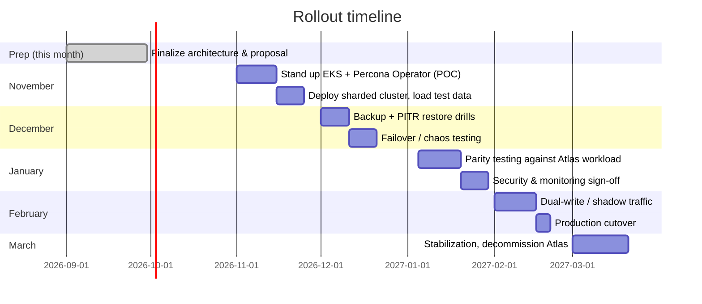

# Migration & Rollout Plan

Target project start: **November 2026**. This is a phased plan — we don't cut over to production until we've proven backup/restore and failure handling work under realistic load.

## Phase 1 — Proof of Concept (November)

- Stand up an EKS cluster and install the Percona Operator for MongoDB.
- Deploy a sharded cluster matching the Scenario A/B sizing from [architecture.md](architecture.md).
- Load representative (anonymized or synthetic) data at real volume to validate the sizing assumptions.
- **Exit criteria**: cluster is healthy, sharded, and reachable; basic backup running successfully.

## Phase 2 — Backup, Recovery & Resilience Testing (December)

- Enable PITR and run full restore drills, including restoring to a specific point in time.
- Run failure drills: kill a primary, kill an AZ's worth of nodes, kill a shard, and confirm automatic recovery.
- Document actual RTO (time to recover) and RPO (data loss window) achieved, and compare against the customer's requirements.
- **Exit criteria**: at least one successful timed restore drill, and one successful failover drill, documented.

## Phase 3 — Parity & Validation (January)

- Replay or mirror real query patterns against the new cluster to validate performance parity with Atlas.
- Complete the security review (TLS, encryption at rest, network policies, IAM) and monitoring/alerting sign-off.
- Finalize the real cost numbers using actual resource utilization from this phase (replacing the estimates in [cost-comparison.md](cost-comparison.md)).
- **Exit criteria**: performance and security sign-off from both engineering and the customer.

## Phase 4 — Cutover (February)

- Stand up dual-write or change-stream-based sync so the new cluster stays current with Atlas during the transition window.
- Cut application traffic over during a planned maintenance window, with a tested rollback path back to Atlas.
- Monitor closely for the first 1-2 weeks post-cutover before declaring it final.

## Phase 5 — Stabilize & Decommission (March)

- Address any issues surfaced during early production operation.
- Once confidence is high (typically 2-4 weeks of stable operation), decommission the Atlas cluster and stop that spend.
- Hand over runbooks and on-call documentation to whoever owns ongoing operations (customer team and/or KubeNine, depending on the support model agreed).

---
Back to [README](../README.md) · Previous: [Cost comparison](cost-comparison.md) · Next: [Risks & open questions](risks-and-open-questions.md)
